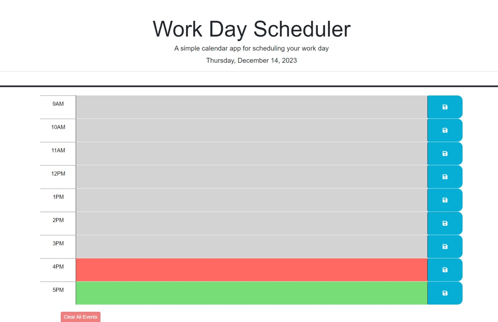
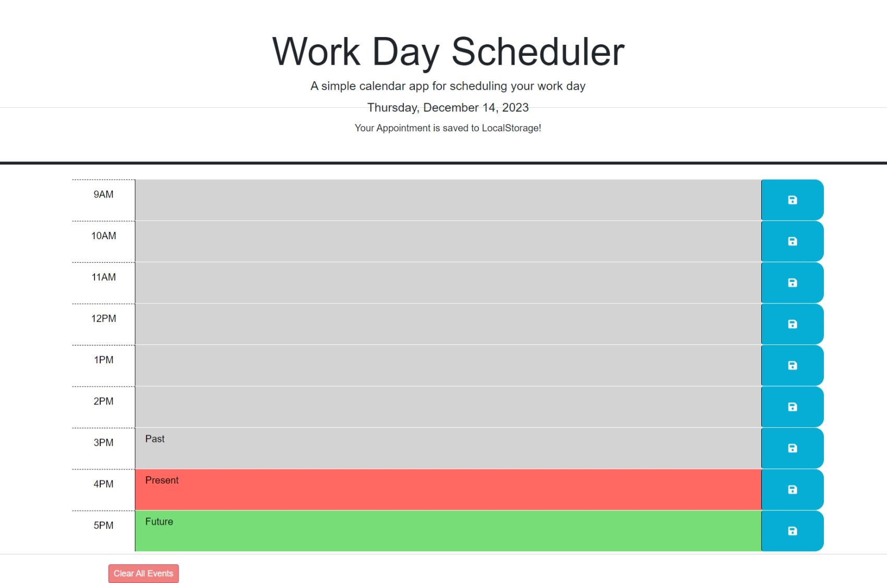

# Schedule_Builder

## Description
In this week challenge #5, as a transitional web developer I was tasked with crafting a user-friendly calendar app, allowing individuals to effortlessly log their day-to-day activities from 9 am to 5 pm. The web-based application was built using HTML, CSS, jQuery, and JavaScript, making it both professional and easy to use. Likewise, the incorporation of the Day.js library enhances the app's functionality, particularly in managing dates and times with efficiency. In essence, creating this calendar deliver solutions that prioritize user needs, offering a straightforward approach to enhancing productivity and organization. It's not just an web-based application; it's a practical tool designed to make the workday more structured and efficient for every user.

## Acceptance Criteria
GIVEN I am using a daily planner to create a schedule

WHEN I open the planner

THEN the current day is displayed at the top of the calendar

WHEN I scroll down

THEN I am presented with timeblocks for standard business hours of 9am to 5pm

WHEN I view the timeblocks for that day

THEN each timeblock is color coded to indicate whether it is in the past, present, or future

WHEN I click into a timeblock

THEN I can enter an event

WHEN I click the save button for that timeblock

THEN the text for that event is saved in local storage

WHEN I refresh the page

THEN the saved events persist

## Technologies
The technologies I used in this challenge includes:
1. HTML: template working HTML file was given that structures the basic layout of the schedule builder and the buttons.
2. CSS: template working CSS file was given which includes the necessary styling of the schedule builder application.
3. Github: Github was used to create a repository which includes the links to the projects, assets folder, and the README file.
4. Gitlab: Gitlab was used to clone the project to our laptop.

## Installation

To install the challenge #5, first create a new repository in your GitHub account, and then clone this repository to your local computer.

To clone: git clone https://github.com/your-username/repository-name.git

## Deployment

1. Deploy your code by running "git add", "git commit", and "git push" in your local repository.

2. Visit your GitHub repository online, click 'Settings', and then select 'Pages' on the left.

3. In GitHub Pages, set the 'main' branch as the source and click 'Save'.

4. Access your live site at <your-github-username.github.io/your-repository-name>. For example, if your username is "lernantino" and your repo is "css-demo-site", the URL is <lernantino.github.io/css-demo-site>.

## Screenshot

     

   

   
 

## Resources
[W3schools_jQuery-Third Party APIs ](https://www.w3schools.com/jquery/default.asp)

[MDN web docs_Third Party APIs](https://developer.mozilla.org/en-US/docs/Learn/JavaScript/Client-side_web_APIs/Third_party_APIs)

## Links

[GitHub Repository link](https://github.com/MunibaP/Schedule_Builder-.git)

[Deployment link](https://munibap.github.io/Schedule_Builder-/)

## License

Redistribution of the CVW software or derived works must reproduce MITRE's copyright designation and this License in the documentation and/or other materials provided with the distribution.Copyright © 1994-1999. The MITRE Corporation (http://www.mitre.org/). All Rights Reserved.
